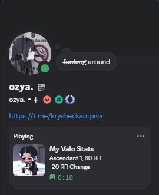

Hi @everyone!
This project shows your Valorant stats directly in your Discord profile using Rich Presence.
It looks like this!

Feel free to customize it however you want, but please tag me. I would love to see what you create.

To run this project you need:
1. HenrikDev Api (https://api.henrikdev.xyz/dashboard/)
2. From Discord Developer Portal Application ID (guide: https://www.youtube.com/watch?v=aWtc_kpqSVk)
3. Your Nickname, Tag and Region

Open `config.py` and fill in:

- DISCORD_CLIENT_ID
- REGION
- NICKNAME
- TAG

Disclamer

This app uses the unofficial Valorant API provided by HenrikDev.

I am not responsible for the data returned by the API, and this project is not affiliated with Riot Games.

This application does **not collect or store any personal data**.
All requests are made directly from your machine to the API.
